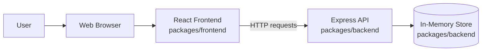
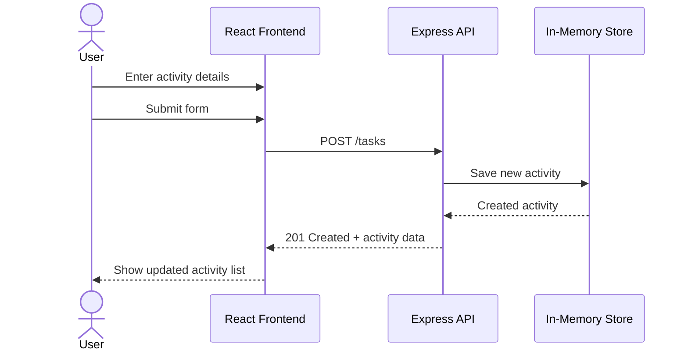

# Cloud Architecture Overview

This project is a simple monorepo-based TODO application with a React frontend and an Express backend that stores data in memory.

## System Context

## User Flow: Create a New Activity

## Notes

- The **React frontend** renders the task UI and sends requests to the backend.
- The **Express API** handles application logic and exposes task endpoints.
- The **in-memory store** keeps task data only while the backend process is running.
- No persistent database is shown because the backend currently stores data in memory.